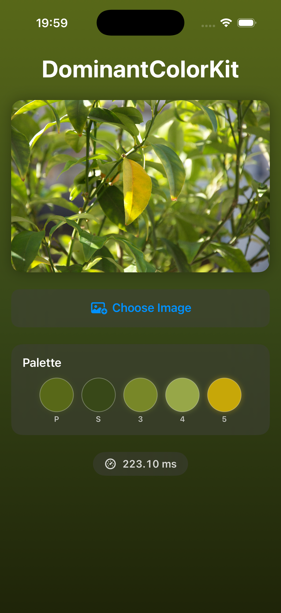

# DominantColorKit

Dominant color extraction for iOS on the CPU. Decodes a small ImageIO thumbnail, builds a 16³ RGB histogram and selects a perceptually diverse 5-color palette with Spotify-style gradient generation.

<p align="center">
  
</p>

## Features

- ImageIO thumbnail (≤96 px, subsampled decode) + 16³ histogram; stateless and `Sendable`
- Perceptual palette selection: saturation-weighted scoring with minimum-distance diversity constraint
- Spotify-style 3-stop vertical gradient from extracted colors
- Accepts encoded `Data` (preferred), `CGImage`, or `UIImage`; colors are gamma-encoded sRGB
- async/await API
- iOS 16+, Swift 5.9+

## Installation

Add via Swift Package Manager:

```swift
dependencies: [
    .package(url: "https://github.com/<you>/DominantColor.git", from: "1.0.0")
]
```

Or in Xcode: File > Add Package Dependencies, paste the repository URL.

## Usage

```swift
import DominantColorKit

let extractor = DominantColorExtractor()
let result = try await extractor.extract(from: data)   // encoded JPEG/PNG/HEIC bytes

// 5 dominant colors sorted by perceptual relevance
result.colors     // [SIMD3<Float>]
result.primary    // most dominant
result.secondary  // second most dominant

// Spotify-style gradient stops (top, middle, bottom)
result.gradientStops  // [SIMD3<Float>]
```

## Architecture

1. **Thumbnail** — ImageIO decodes straight to ≤96 px on the long side (JPEG/HEIC are subsampled during decode; the full image is never materialised).
2. **Raster** — draw into an 8-bit sRGB RGBA buffer (~37 KB).
3. **Histogram** — 16³ bins with per-bin colour sums; pixels with alpha < 50 % are skipped.
4. **Select** — saturation-weighted score, greedy diverse pick of 5 colours.

Result: `DominantColorResult { colors, primary, secondary, gradientStops }`.

### Palette selection algorithm

1. **Score** each bin: `count * weight(color)`
   - Near-black (brightness < 0.08): 0.1x penalty
   - Near-white (brightness > 0.75, saturation < 0.15): 0.2x penalty
   - Grays (saturation < 0.08): 0.3x penalty
   - Saturation boost: up to 4x for fully saturated colors
2. **Sort** bins by score descending
3. **Greedy pick**: select top scorer, then for each next pick require Euclidean RGB distance >= 0.15 from all already-chosen colors

This prevents palettes filled with 5 shades of white/gray and favors visually interesting, diverse colors.

## Project structure

```
DominantColor/
  Package.swift
  Sources/DominantColorKit/
    DominantColorExtractor.swift    # Main API, ImageIO + raster pipeline
    PaletteBuilder.swift            # Histogram + palette selection
    GradientGenerator.swift         # Spotify-style 3-stop gradient
    Models/
      DominantColorResult.swift     # Output struct
  Example/
    DominantColor.xcodeproj
    DominantColor/                  # SwiftUI demo app
```

## Example app

Open `Example/DominantColor.xcodeproj` in Xcode. The app demonstrates:

- Image selection via PhotosPicker
- Extracted 5-color palette display
- Fullscreen animated gradient background
- Extraction time measurement in milliseconds

## Performance

See `docs/decisions/2026-10-07-dominant-color-benchmark.md` for measured numbers (12 MP JPEG, simulator).

## Memory footprint

Working set is the ≤96 px thumbnail (~37 KB RGBA) plus a 16³-bin histogram (counts + color sums, ~64 KB).

## License

MIT
